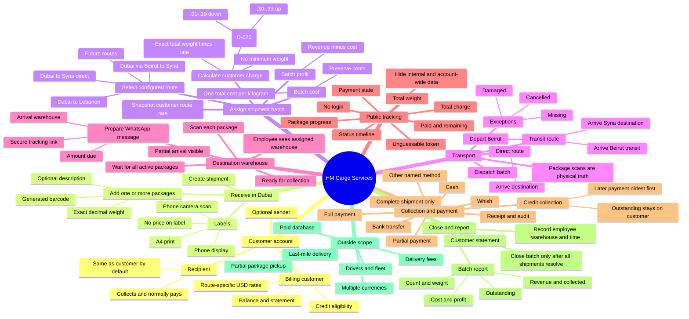

# Shipment Lifecycle Mind Map

```mermaid
mindmap
  root((HM Cargo Services))
    Customer account
      Billing customer
        Route-specific USD rates
        Credit eligibility
        Balance and statement
      Recipient
        Same as customer by default
        Collects and normally pays
      Optional sender
    Receive in Dubai
      Create shipment
      Add one or more packages
        Generated barcode
        Exact decimal weight
        Optional description
      Labels
        A4 print
        Phone display
        Phone camera scan
        No price on label
    Assign shipment batch
      Select configured route
        Dubai to Lebanon
        Dubai to Syria direct
        Dubai via Beirut to Syria
        Future routes
      Snapshot customer route rate
      Calculate customer charge
        Exact total weight times rate
        No minimum weight
        Final charge set manually (D-020)
          .01-.29 down
          .30-.99 up
      Batch cost
        One total cost per kilogram
        Preserve cents
      Batch profit
        Revenue minus cost
    Transport
      Dispatch batch
      Direct route
        Arrive destination
      Transit route
        Arrive Beirut transit
        Depart Beirut
        Arrive Syria destination
      Package scans are physical truth
      Exceptions
        Missing
        Damaged
        Cancelled
    Destination warehouse
      Employee sees assigned warehouse
      Scan each package
      Partial arrival visible
      Wait for all active packages
      Ready for collection
      Prepare WhatsApp message
        Arrival warehouse
        Amount due
        Secure tracking link
    Public tracking
      No login
      Unguessable token
      Status timeline
      Package progress
      Total weight
      Total charge
      Paid and remaining
      Payment state
      Hide internal and account-wide data
    Collection and payment
      Complete shipment only
      Cash
      Whish
      Bank transfer
      Other named method
      Full payment
      Partial payment
      Credit collection
        Outstanding stays on customer
        Later payment oldest first
      Receipt and audit
    Close and report
      Record employee warehouse and time
      Customer statement
      Batch report
        Count and weight
        Revenue and collected
        Outstanding
        Cost and profit
      Close batch only after all shipments resolve
    Outside scope
      Last-mile delivery
      Delivery fees
      Multiple currencies
      Drivers and fleet
      Paid database
      Partial package pickup
```

